## Descarga, instalación y ejecución de producto

Es una aplicación responsiva, mobile first, se accede por medio del link: 
ameyallibg/mex007-hackathon-interna

### Herramientas usadas
La aplicación está estructurada utilizando:
 - Un editor de texto (Visual Code) 
 - Vanilla JS
 - HTML 5
 - CSS
 - GitHub 
 - GitHub Pages 
 - Git Bash 
 - Node.js
 - Jest
 - Marvel

### Scripts / Archivos
- README.md: explica cómo descargar, instalar y ejecutar la aplicación así como una introducción a la aplicación, su funcionalidad y decisiones de diseño tomadas.
- data.js: contiene las funciones que manipulan la data (procesar y filtrar).
- main.js: set de datos que muestra la lista de películas.
- data.js: es donde se implementan los eventos del DOM para permitir interacción con el usuario al mostrar y ordenar la data, el cual debe estar exportado en el objeto global (window).
- html/index: tiene la estructura de la página.
- CSS: permite dar el diseño a la interfaz en elementos como la tipografía, color, imagen de fondo, acomodar los elementos como textos, imágenes, botones, lista desplegable, encabezado, contenido y pie de página.
<<<<<<< HEAD
- Prototipos: Carpeta de imágenes galería con los prototipos de baja y alta fidelidad.
- Encuestas: Carpetas de gráficas de los test realizados.

## Definición del producto
**O´ccult Movie** es una app diseñada para aquellas personas que están adentrándose en el Cine de Arte (también conocido como cine de culto o cine de autor) y, por tal motivo, necesitan y buscan recomendaciones para lograrlo.

## Definición de Usuario##
Personas de 18 a 45 años que comienzan, quieren y buscan la manera de adentrarse al mundo del Cine de Arte culto y para esto desean obtener información sintetizada de las películas para animarse a verlas y ampliar su acervo cinéfilo.

=======
- Carpeta de imágenes: galería con los prototipos de baja y alta fidelidad, así como la evidencia de las encuestas realizadas.

## Ejecución de pruebas
El boilerplate contiene la configuración necesaria para ejecutar los tests, en este caso las pruebas unitarias.
Se ejecutan eslint y htmlhint para verificar el HTML y JavaScript con respecto a una guías de estilos. Ambas tareas se ejecutan automáticamente antes de ejecutar las pruebas cuando se escribe el comando npm run test. 
Finalmente, está el code coverage para ver el nivel de cobertura de los tests también utilizando el comando npm run test.

## Definición del producto
**Cinema ** es una app diseñada para aquellas personas que están adentrándose en el cine de arte (también conocido como cine independiente o cine de autor) y, por tal motivo, buscan qué películas pueden ver. 
 
>>>>>>> upstream/master
## Historias de usuario
1. Yo, como usuario que empiezo a conocer sobre cine de arte, quiero encontrar las películas por su nombre para así poder llegar a ella con facilidad.

2. Yo, como usuario que empiezo a conocer sobre cine de arte, quiero encontrar películas a partir del nombre del director para ver todas las de su autoría.

<<<<<<< HEAD
3. Yo, como usuario que empiezo a conocer sobre cine de arte, quiero saber lo más relevante de una película por medio de una breve sinopsis para tener una idea de su contenido.

4. Yo, como usuario, quiero ver las películas que tienen algún tipo de premiación, para tener una garantía de que es una buena película.
 
## Diseño de experiencia de usuario (User Experience Design):
**Ideación**
El objetivo es lograr que la interacción sea intuitiva, fácil de usar y que logre alcanzar a introducir efectivamente a nuestro usuario al mundo del Cine de Arte Culto.
=======
3. Yo, como usuario, quiero saber lo más relevante de una película por medio de una  sinopsis para saber si quiero o no ver dicha película.
 
## Diseño de experiencia de usuario (User Experience Design):
**Ideación**
El objetivo es lograr que la interacción sea intuitiva, fácil de usar. La interacción ocurre en una sola pantalla en la que el usuario realiza una búsqueda por título de película o director en el campo de búsqueda. Como resultado, la página filtrará el resultado.
Debajo del buscador hay un menú en el que el usuario puede hacer búsqueda de películas por género, director o por premiaciones y finalmente está la opciónd de "acerca de" en donde se despliega información sobre el objetigo de la página, que es brindar información y recomendación de películas para que la gente pueda tomar decisión para ver o no una cinta, así como también una aclaración sobre la definición de cine de arte.
>>>>>>> upstream/master

##Fotos de los bocetos hechos en hoja con bolígrafo

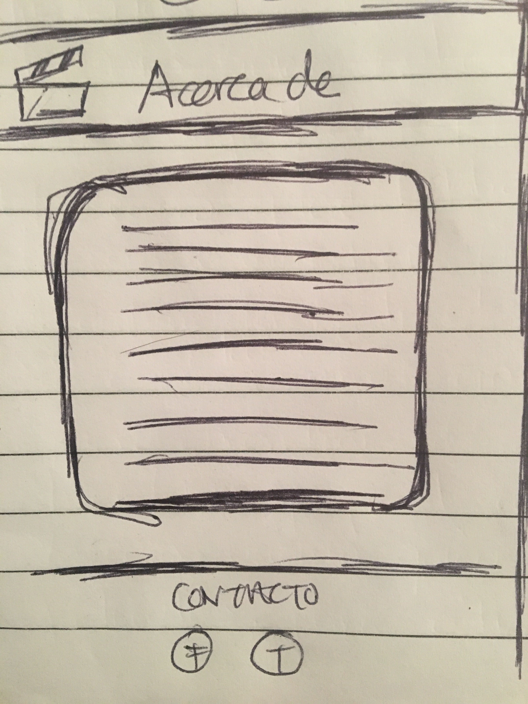

##Prototipo de alta fidelidad (User Testing)
Imágenes editadas en Marvel
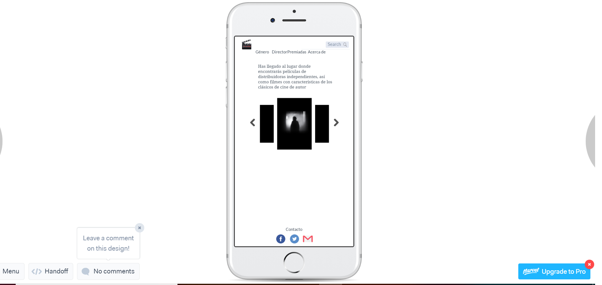
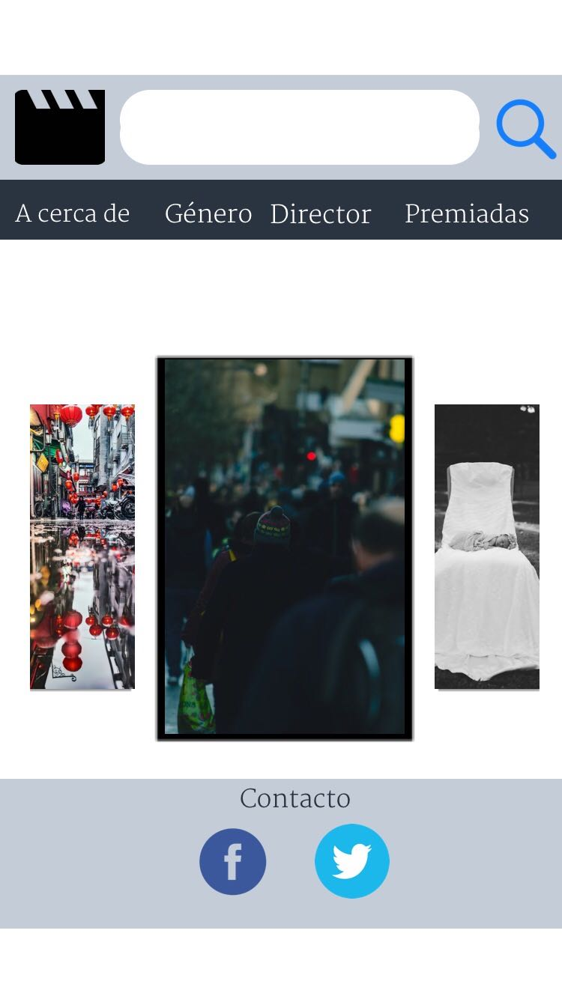

##Encuesta
Evidencia de la encuesta inicial, realizada a 25 personas, donde sus respuestas confirmaron que sí son usuarias de páginas para consultar información sobre películas, asimismo brindaron una orientación para realizar el diseño en mobile first.

##Pruebas de usabilidad
**Resultados Primer Test**
En primera instancia se realizó un test a 25 personas para saber:

-Si existía la necesidad de usuarios de encontrar recomendaciones para ver películas.
-A travéz de qué dispositivos suelen realizar estas búsquedas.
-Qué información necesitan para decidir ver una película o no.
-Conocer la afinidad de las personas hacia el Cine de Arte Culto.

Se obtuvo:
-El 92% de los encuestados, es decir 23 personas, han tenido la necesidad de buscar recomendaciones de películas.
-17 personas prefieren utilizar un celular para realizar este tipo de búsquedas.
-21 personas gustan del Cine de Arte De Culto.
-La información que necesitan principalmente para decidir ver una película son: Sinopsis(68%),Género(40%),Director(24%), Premiaciones(20%).

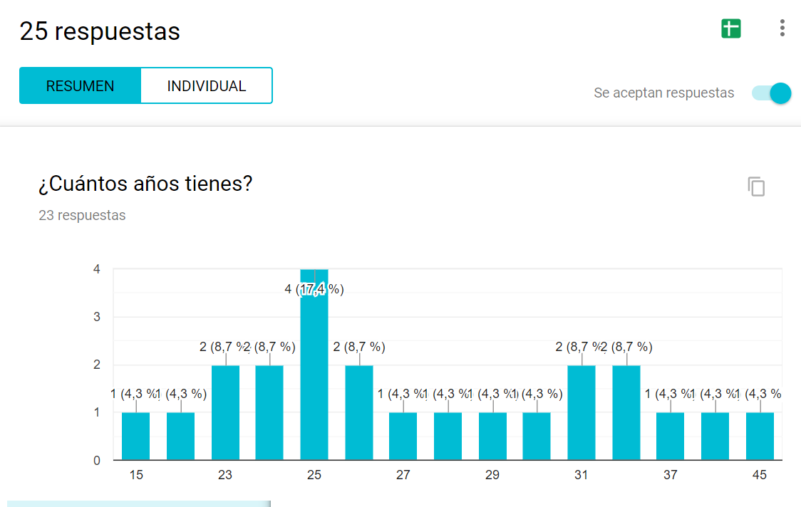
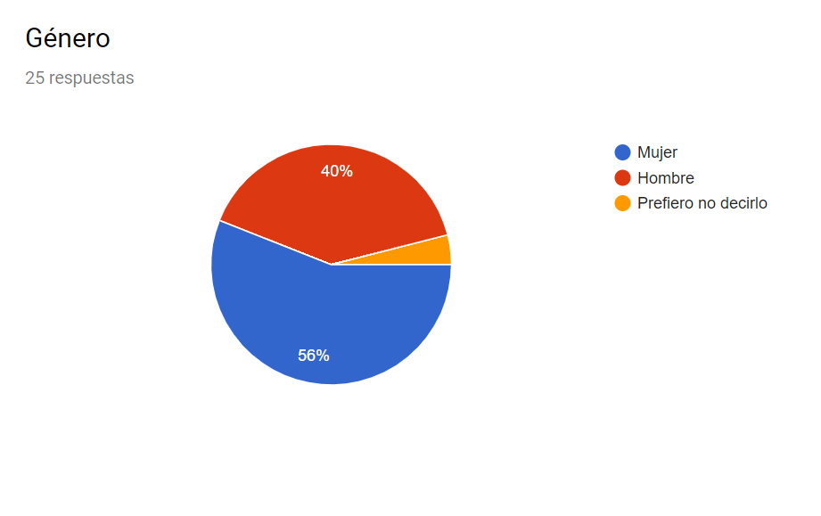
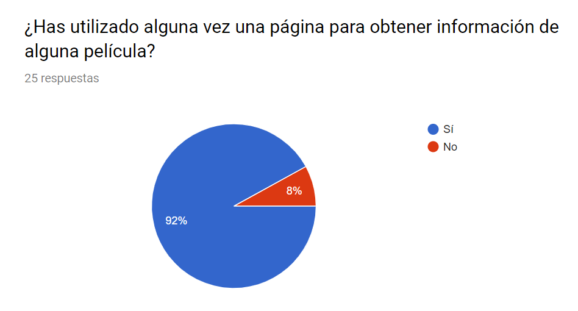
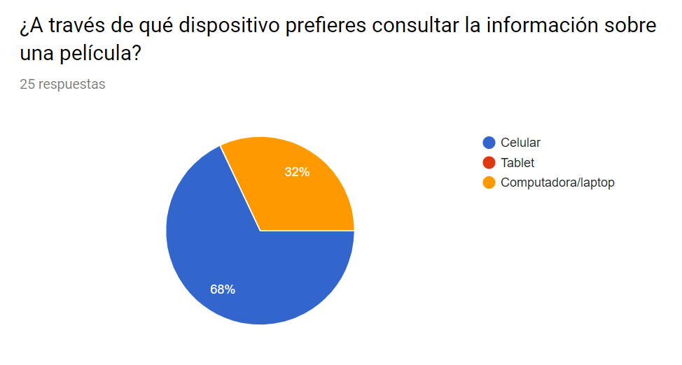
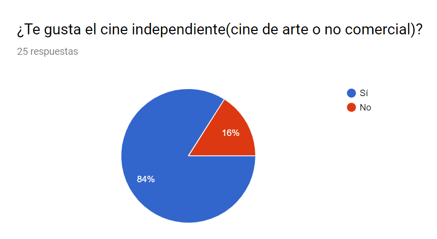
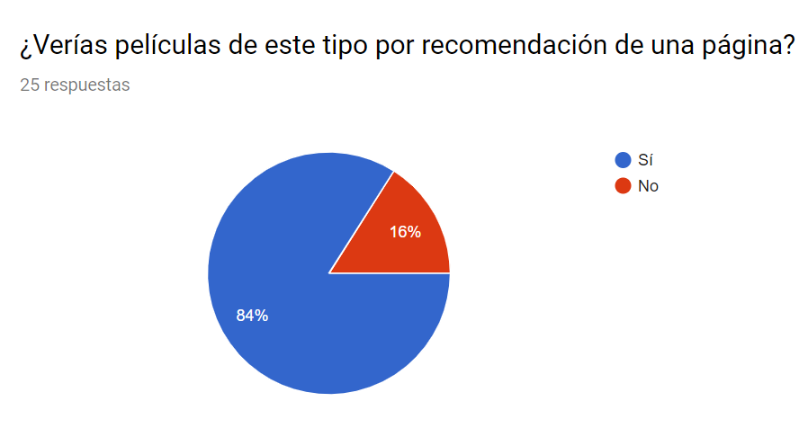
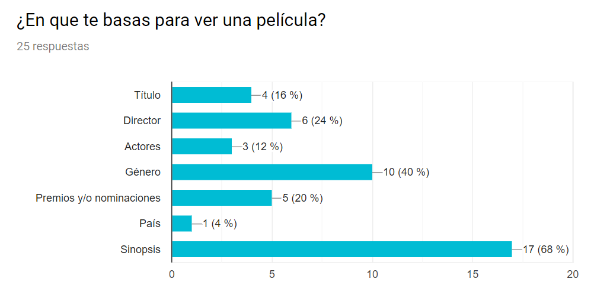

**Resultados Segundo Test**
Se les presentó a 6 personas de manera presencial una muestra de 4 prototipos de alta fidelidad para conocer:

- Si la interfaz se entendía.
- Si la distribución de los elementos era adecuada.
- Qué colores preferían.
- Qué le cambiarían.

Se obtuvo:
- 4 personas entendieron la interfaz sin problema de los 4 mostrados.
- 5 personas les pareció adecuado la distribución de los elementos del segundo prototipo mostrado
- A 6 personas le agradó la gama de colores del tercer prototipo mostrado.

Muestra de Prototipos

**Problemas de usabilidad y diseño detectados a través de encuestas**
Encuesta virtual realizada a 25 personas y encuesta presencial realizada a 6 personas de los cuáles los problemas encontrados son los siguientes:

-Innecesario botón de información a cerca de la página, no se utiliza ni se consulta, agregar esta información muy breve en página principal.
-Desean ver el año de las películas
-Prefieren un fondo oscuro.
-Más espacio de bordes entre elementos y pantalla, se ve apretado.
-Contacto de redes sociales sin sentido.
-Sección principal con encabezado de TOP 5, arriba de carrusel confunde.
-Sección de "CONTACTO" nada útil hasta el momento.

**Cambios Realizados**
En base a los problemas de usabilidad y diseño que la encuesta presencial nos arrojó, se realizaron los siguientes cambios:

-Se eliminó sección "Acerca de" y en su lugar, brevemente se agregó la especificación de nuestro contenido en la pantalla principal.
-Se le dió mayor espacio, margenes y bordes a las fichas de las películas.
-Mayor grosor a la barra que contiene el título de la página y el buscador.
-El fondo se oscureció.
-Se eliminó frase "TOP 5".
-Se eliminó sección de "CONTACTO".

##Prototipos de Alta Fidelidad Finales Mobile y Desktop
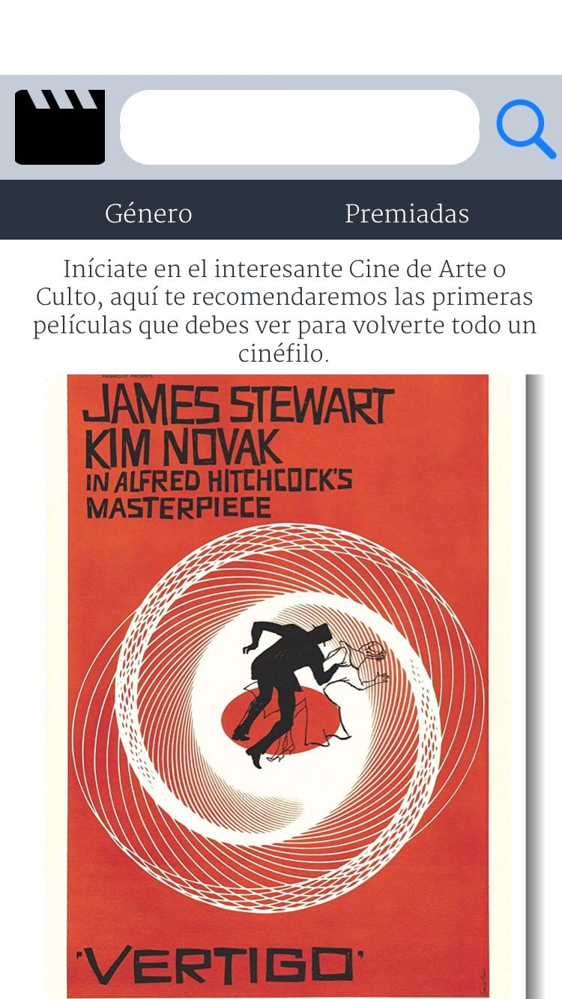
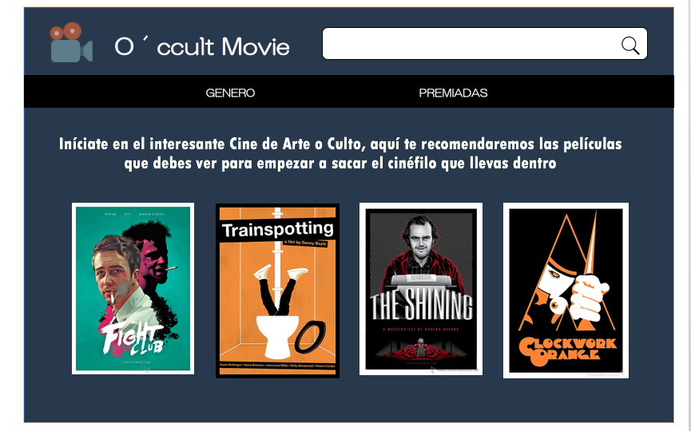

## Implementación de la Interfaz de Usuario (HTML/CSS/JS)
Se muestra la data en una interfaz: una lista con las imágenes que contienen el poster, el título, el género, año y el director de cada película, de un total de 34 películas. Al dar click a cada imagen, se desplegará una tarjeta que mostrará más datos de la película seleccionada.
La aplicación permite al usuario realizar búsqueda por letra, es decir, se puede colocar la inicial y se muestran las películas o directores que coincidan con dicha inicial.
La aplicación permite al usuario filtrar la data:ya sea por título, género y/o director. 
La información se visualiza sin problemas desde distintos tamaños de pantallas: móviles, tablets y desktops.

##Alcances a Futuro
-Debido a que el contenido se encuentra en inglés, uno de los alcances consiste en traducir todo el contenido y se encuentre accesible al idioma español.
-Aumentar la cantidad de películas.
-Otro de ellos consiste en la funcionalida de compartir las recomendaciones que el usuario desee por medio de sus redes sociales, implementando el loggin de Facebook y Twitter principalmente.

## Autores
* Ameyalli Brito
* Maritza Díaz 
* Jazmín Domínguez
* Katya Rodríguez

## División de tareas
**Primer Sprint:**
* Todas: definir qué tipo de app se desarrollaría y la información a mostrar, delimitación del target.
* Ameyalli y Jazmín: extraer el código a usar desde la API, entender y manipular la data.Escribir código, crear función de filtrar.
* Katya y Maritza: Historias de usuario, prototipo de baja y alta fidelidad, elaboración y aplicación de encuestas para saber qué información mostrar. Escribir parte del maquetado en HTML y CSS (barra de navegación, pie de página, lista desplegable). Redacción del ReadMe.

**Segundo Sprint**
* Todas: definir qué se haría para el entregable final, qué se agregaría y qué se modificaría con base en el feedback de la primera demo.
* Ameyalli: escritura de código para implementar el carrusel.
* Jaz: escritura de código para tener la función de filtro e impresión por género.
* Katya y Maritza: modificación de producto a presentar, tener una definición más certera sobre "cine de arte", agregar las evidencias de la primera encuesta al ReadMe, redacción y elaboración para la encuesta de usabilidad. Discusión entre squad para considerar el feedback y realizar los cambios pertinentes.

##Fuentes consultadas
* http://capitaljovenisic.org.mx/blog/post/
* las-10-mejores-pel%C3%ADculas-de-cine-de-arte-que-no-te-puedes-perder-/252
* https://culturacolectiva.com/cine/por-que-es-cine-de-arte
* http://cinemania.elmundo.es/especiales/las-100-mejores-webs-de-cine/
* https://encuadres.com.mx/ 

* Trello: https://trello.com/b/jPFaVEDo/hackatoncito 