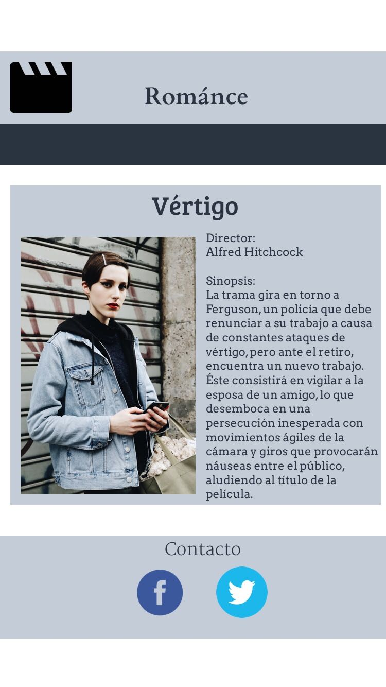

## Descarga, instalación y ejecución de producto

Es una aplicación responsiva, mobile first, se accede por medio del link: 
ameyallibg/mex007-hackathon-interna

### Herramientas usadas
La aplicación está estructurada utilizando:
 - Un editor de texto (Visual Code) 
 - Vanilla JS
 - HTML 5
 - CSS
 - GitHub 
 - GitHub Pages 
 - Git Bash 
 - Node.js
 - Jest
 - Marvel

### Scripts / Archivos
- README.md: explica cómo descargar, instalar y ejecutar la aplicación así como una introducción a la aplicación, su funcionalidad y decisiones de diseño tomadas.
- data.js: contiene las funciones que manipulan la data (procesar y filtrar).
Funciones implementadas:
* `filterData(data, condition)`: esta función `filter` o filtrar recibiría la
 data, y nos retornaría aquellos datos que sí cumplan con la condición.
- main.js: set de datos que muestra la lista de películas.
- data.js: es donde se implementan los eventos del DOM para permitir interacción con el usuario al mostrar y ordenar la data, el cual debe estar exportado en el objeto global (window).
- html/index: tiene la estructura de la página.
- data.spec.js: se encuentran los tests para confirmar que window.lol es un objeto y que la función de .filter() es unafunción.
- CSS: permite dar el diseño a la interfaz en elementos como la tipografía, color, imagen de fondo, acomodar los elementos como textos, imágenes, botones, lista desplegable, encabezado, contenido y pie de página.
- Carpeta de imágenes: galería con los prototipos de baja y alta fidelidad.

## Ejecución de pruebas
El boilerplate contiene la configuración necesaria para ejecutar los tests, en este caso las pruebas unitarias.
Se ejecutan eslint y htmlhint para verificar el HTML y JavaScript con respecto a una guías de estilos. Ambas tareas se ejecutan automáticamente antes de ejecutar las pruebas cuando se escribe el comando npm run test. 
Finalmente, está el code coverage para ver el nivel de cobertura de los tests también utilizando el comando npm run test.

## Definición del producto
**Cinema ** es una app diseñada para aquellas personas que están adentrándose en el cine independiente (también conocido como cine de arte o cine de autor) y, por tal motivo, buscan qué películas pueden ver. 
 
## Historias de usuario
1. Yo, como usuario, quiero encontrar las películas por su nombre porque así es más fácil reconocerlas.

2. Yo, como usuario, quiero encontrar películas a partir de determinados directores porque al ya haber visto una quiero conocer más sobre el mismo director.

3. Yo, como usuario, quiero saber lo más relevante de una película por medio de una breve sinopsis para saber si quiero o no ver dicha película.

4. Yo, como usuario, quiero conocer el ranking de las películas de IMDB para estimar la aceptación pública y saber si quiero verlas o no.
 
## Diseño de experiencia de usuario (User Experience Design):
**Ideación**
El objetivo es lograr que la interacción sea intuitiva, fácil de usar.

##Fotos de los bocetos hechos en hoja con bolígrafo

##Prototipo de alta fidelidad (User Testing)
Imágenes editadas en Photoshop

##Pruebas de usabilidad
**Problemas de usabilidad detectados a través de los tests**
pendiente

## Implementación de la Interfaz de Usuario (HTML/CSS/JS)
Se muestra la data en una interfaz: una lista con las imágenes que contienen el poster, el título y el director de cada película, en el primer sprint son 16 en total. Al dar click a cada imagen, se desplegará una tarjeta que mostrará más datos de la película seleccionado.
La aplicación permite al usuario realizar búsqueda por letra, es decir, se puede colocar la inicial y se muestran las películas o directores que coincidan con dicha inicial.
La aplicación permite al usuario filtrar la data:ya sea por título, género y/o director. 

*pendiente: La información se visualiza sin problemas desde distintos tamaños de pantallas: móviles, tablets y desktops.

## Autores
* Ameyalli Brito
* Maritza Díaz 
* Jazmín Domínguez
* Katya Rodríguez

## División de tareas
Todas: definir qué tipo de app se desarrollaría y la información a mostrar, delimitación del target.
* Ameyalli y Jazmín: extraer el código a usar desde la API, entender y manipular la data.Escribir código, crear función de filtrar.
* Katya y Maritza: Historias de usuario, prototipo de baja y alta fidelidad, elaboración y aplicación de encuestas para saber qué información mostrar. Escribir parte del maquetado en HTML y CSS (barra de navegación, pie de página, lista desplegable). Redacción del ReadMe.

##Fuentes consultadas
* http://capitaljovenisic.org.mx/blog/post/
* las-10-mejores-pel%C3%ADculas-de-cine-de-arte-que-no-te-puedes-perder-/252
* https://culturacolectiva.com/cine/por-que-es-cine-de-arte
* http://cinemania.elmundo.es/especiales/las-100-mejores-webs-de-cine/
* https://encuadres.com.mx/ 

* Trello: https://trello.com/b/jPFaVEDo/hackatoncito 
